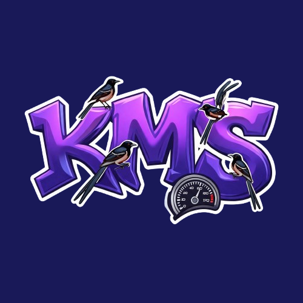

	

<h1 align="center">Kicau Mania Speed</h1>

**Kicau Mania Speed** adalah sebuah permainan interaktif berbasis web yang memanfaatkan teknologi pendeteksi gerakan tangan (_Hand Tracking_) menggunakan webcam. Dalam game ini, pemain ditantang untuk melakukan gerakan mengayunkan tangan secepat mungkin untuk mendapatkan skor tertinggi!

## Mekanik Permainan

1. **Akses Kamera:** Saat ingin bermain, berikan izin akses kamera pada browser.
2. **Hitung Mundur:** Akan ada waktu persiapan (countdown) selama 3 detik sebelum permainan dimulai.
3. **Masa Bermain (15 Detik):** Setelah hitung mundur selesai, audionya akan berbunyi dan kamu punya waktu **15 detik** untuk mengayunkan tanganmu ke arah kamera. Sistem komputer (AI) akan mendeteksi ayunannya dan tiap ayunan akan dihitung sebagai skor.
4. **Selesai:** Permainan otomatis berhenti setelah 15 detik. Skor tertinggi kamu akan tercatat dan bersaing di fitur **Leaderboard**!

## Teknologi yang Digunakan

Proyek ini dikembangkan menggunakan _modern web stack_:

- **Frontend:** [Next.js](https://nextjs.org/) (App Router), React, dan Tailwind CSS.
- **Pendeteksi Gerakan (Computer Vision):** [@mediapipe/hands](https://google.github.io/mediapipe/solutions/hands) & Camera Utils.
- **Autentikasi User:** [Clerk](https://clerk.dev/).
- **Database (Leaderboard):** [MongoDB](https://www.mongodb.com/) dengan Mongoose.

## Cara Menjalankan Proyek Secara Lokal

Jika kamu ingin menjalankan atau berkontribusi pada proyek ini di komputer lokal:

1. Clone repositori ini.
2. Install dependensi menggunakan
   npm install, yarn install, atau pnpm install.
3. Atur _Environment Variables_ (.env) untuk Clerk dan MongoDB.
4. Jalankan _development server_:

`npm run dev`

Buka [http://localhost:3000](http://localhost:3000) di browser untuk melihat hasilnya.

## Kontribusi

Tertarik untuk membuat _Kicau Mania Speed_ lebih baik? Fitur baru, perbaikan bug, maupun peningkatan algoritma deteksi ayunan tangan akan sangat diterima!

  
   
  <i>Mari bergabung dan kembangkan proyek ini bersama!</i>

